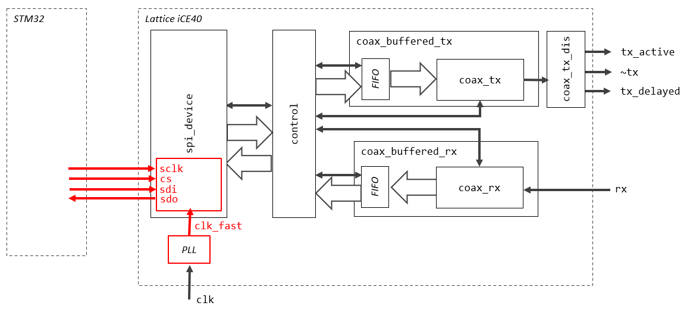

# interface2

A modern USB connected interface using Lattice iCE40 FPGA and STM32 microcontroller.

## Design

## Hardware

You can find the Gerber files for fabricating a PCB in the [fabrication](pcb/fabrication) directory. I have used JLCPCB to make the PCBs.

## FPGA

An FPGA is used to handle the [3270 coax protocol](../protocol/protocol.md), it provides a simple TX and RX FIFO to a SPI connected microcontroller.

The design targets the [Lattice iCE40 UltraPlus 5K](http://www.latticesemi.com/view_document?document_id=51968) device.

* Everything, except for the SPI slave in `spi_device`, runs at a 38 MHz clock
* The SPI slave runs at 80 Mhz in order to be able to run the SPI clock reliably at 10 Mhz
* `rx` is oversampled in `coax_rx`
* The `control` module exposes three registers to the microcontroller:
    - status (read only)
    - control
    - device id (read only)
- The `control` module also supports transmit and receive commands for writing to and reading the relevant FIFOs

## Firmware
